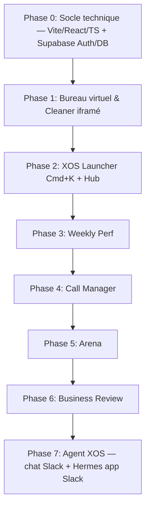

# 🌌 Projet X OS — Portail Intranet de Pilotage Commercial

**Version 2 — plan affiné du 2026-07-10** (v1 conservée dans l'historique git).

Le projet **X OS** (jeu de mots avec XOS et Operating System) est un portail intranet conçu sous la forme d'un **système d'exploitation virtuel (Virtual Desktop)** s'exécutant dans le navigateur.

L'objectif est double :
1. **Pour les Managers** : Offrir un cockpit de pilotage en temps réel de la performance commerciale et de l'hygiène du CRM.
2. **Pour les Commerciaux** : Simplifier leur quotidien en réduisant les frictions de saisie et en priorisant leurs actions avec des outils simples et interactifs.

---

## 🧭 Décisions d'architecture (actées le 2026-07-10)

| Sujet | Décision | Motivation |
|---|---|---|
| **Stack front** | **Vite + React + TypeScript**, SPA statique. Pas de Next.js. | Composants réutilisables entre apps, état réactif partagé, et garde-fous mécaniques (tsc, ESLint) pour le contrôle qualité du travail des agents d'implémentation. L'API existe déjà en serverless, un framework fullstack n'apporte rien. |
| **Dashboard déchet actuel** | **Préservé tel quel** (`dashboard.html` + `api/refresh.py` + `api/update.js` intouchés), embarqué en **iframe** dans la fenêtre "CRM Cleaner". Migration React ultérieure, app par app, jamais big-bang. | Zéro risque de régression sur la seule app en production. La préservation ne contraint pas la stack du reste du portail. |
| **Authentification** | **Supabase Auth + magic link email**, restreint au domaine `xos-learning.fr` par trigger SQL à l'inscription. Comptes individuels, sessions JWT persistantes par device, révocation immédiate. *(Google SSO abandonné le 2026-07-10 : Théo n'est pas admin Workspace du client.)* | Un mot de passe partagé est inacceptable pour une app qui écrit dans Salesforce, affiche la perf individuelle et gamifie l'équipe. |
| **Persistance** | **Supabase Postgres** : profils (mapping ↔ user Salesforce), challenges/scores Arena, configuration, journal d'actions. | Le journal actuel en Blob immuable est déjà un contournement des limites de Vercel Blob (pas de read-modify-write sûr). Arena et la config exigent requêtes, transactions et concurrence propres. |
| **Écritures Salesforce** | Via l'**utilisateur d'intégration** côté serveur (comme aujourd'hui), chaque action **attribuée à la personne connectée** dans le journal Postgres. | Upgrade possible plus tard vers OAuth SF par user (actions sous le nom de chacun dans SF) sans rien casser. |
| **API** | Endpoints serverless Vercel conservés et étendus (nouveaux endpoints en Node, protégés par vérification du JWT Supabase). | Continuité, pas de réécriture. |
| **Périmètre** | **Tout le plan, phasé** : socle → Launcher → Weekly Perf → Call Manager → Arena. | Architecture dimensionnée pour l'ensemble dès le départ. |
| **Cible d'affichage** | Desktop-first (métaphore bureau). Mobile : consultation dégradée non prioritaire. | Le public est l'équipe commerciale au poste de travail. |
| **Déploiement & URL** | Projet Vercel renommé **xos**, domaine canonique actif : **`https://xos.hellotheo.fr`** (redirect URL Supabase à configurer). L'ancien alias **`https://xos-dechet-repo.vercel.app`** reste actif pour assurer la transition. *(⚠️ Ne jamais utiliser xos.vercel.app qui appartient à un autre site).* | Zéro migration d'env vars, iframe same-origin, branding propre pour le lancement. |
| **Tests des écritures SF** | Org de production avec précautions : enregistrements de test créés puis nettoyés ; chaque spec d'agent est relue sous cet angle (pas de sandbox disponible). | Pratique actuelle d'update.js, discipline vérifiée à la gate QC. |
| **Basic Auth legacy** | Coexistence connexion Supabase par lien magique + Basic Auth pendant les phases 0–2, puis **extinction du Basic Auth** une fois l'équipe basculée sur le lien magique Supabase. | Un secret partagé de moins à terme. |
| **Intégration Slack + Agent** | **Chat custom** X OS + **Slack API** (DM user↔bot) pour persistance/miroir mobile. **Cerveau = Hermes, une app Slack** installée dans le workspace (mémoire + skills multi-user, infra opaque côté Théo). X OS/Vercel = UI + **transport Slack uniquement** ; **jamais d'appel direct à Hermes** (tout passe par Slack). Pas d'iframe Slack ; pas d'app Navigateur générique. | Slack refuse l'embarquement. Hermes centralise l'intelligence via sa propre app Slack ; X OS reste le bureau de travail. |

### Réalités des données Salesforce (vérifiées avec Théo)
- Les activités (appels, RDV) **sont loggées** en Tasks/Events → le Pulse hebdo est faisable.
- **L'objet Lead n'est pas utilisé : la prospection vit sur l'objet Contact**, plus Opportunities/Accounts/Campaigns → le Call Manager s'appuie sur les **Contacts à appeler + tâches d'appels Salesforce** (voir app 3). Chaque dashboard commence par un **audit SOQL de volumétrie** pour caler ses définitions avant tout développement UI.

---

## 🎨 Design System & Identité Visuelle (Charte XOS)

Le portail adoptera une esthétique **Dark Mode Premium & Glassmorphism** inspirée des codes visuels de [XOS Learning](https://www.xos-learning.fr/) et de l'interface bureau virtuelle partagée par Thibault Marty (Ottho) :

*   **Palette de couleurs (CSS Variables de la charte XOS)** :
    *   `--greyscale--grey-100` / Fond principal : Bleu Nuit profond (`#0D173F`) pour l'élégance et le confort visuel.
    *   `--primary--primary-200` / Accents & Sélections : Violet néon (`#8B5BFA`) pour les éléments actifs, boutons primaires et focus.
    *   `--secondary--secondary-500` / Points d'attention & Alertes : Jaune Lumineux (`#FFF96F`) pour attirer l'œil sur les anomalies.
    *   `Bordures & Séparateurs` : Translucide (`rgba(255, 255, 255, 0.08)`) avec un léger flou de fond (`backdrop-filter: blur(12px)`).
*   **Typography** : Polices de la charte XOS chargées via `@font-face` :
    *   `Brockmann` (police principale pour le texte et les en-têtes).
    *   `Aeonik` ou `Neue Montreal` (polices secondaires pour les chiffres et les interfaces de tableau de bord).
    *   ✅ **Brockmann livrée** : webfont kit complet dans `fonts/brockmann-complete-webfont/` (woff2 Regular / Medium / SemiBold / Bold + italiques, licence webfont incluse). Les woff2 nécessaires sont copiés dans `public/fonts/` et déclarés en `@font-face` (jamais les .otf desktop, licence différente).
    *   ✅ **Neue Montreal livrée** (`fonts/Neue-Montreal-Font-Family/`, OTF Light→Bold + italiques) : **police secondaire retenue pour les chiffres et dashboards** (conversion OTF → woff2 au build, `tabular-nums`).
    *   ⛔ **Aeonik : fichiers TRIAL uniquement** (EULA d'essai CoType) — **exclue de la production**, ne jamais l'embarquer dans le build.
    *   `Logo officiel` : [logo XOS.webp](https://cdn.prod.website-files.com/6544f8a01bb184e8bf74376c/6548fadbd2f17da27dbdc484_logo%20XOS.webp)
*   **Mise en page "Bureau Virtuel"** :
    *   **Fond d'écran** : Dégradé fluide et animé entre les couleurs de la charte.
    *   **Le Dock X OS** : Barre d'applications flottante en bas de l'écran avec effet de reflet et zoom au survol.
    *   **Gestionnaire de Fenêtres** : Ouvrir, fermer (rouge), réduire (jaune), agrandir (vert), déplacer, redimensionner, focus/z-index — implémenté avec `react-rnd`.

---

## 🏗️ Architecture technique

```
/                        SPA React (Vite build → dist/)
├── src/
│   ├── os/              shell : Desktop, Dock, WindowManager, Launcher, thème
│   ├── apps/            une app = un dossier, contrat AppManifest
│   │   ├── cleaner/     iframe → /dashboard.html (préservé)
│   │   ├── weekly/      Weekly Perf
│   │   ├── calls/       Call Manager (séances de prospection)
│   │   ├── arena/       Gamification
│   │   ├── agent/       Chat Agent XOS (UI custom → Slack API ; Hermes = app Slack)
│   │   └── hub/         Paramètres & statut
│   ├── auth/            login OTP, session, bridge SSO
│   ├── components/ui/   design system partagé
│   ├── lib/             client Supabase, types
│   └── main.tsx
├── public/dashboard.html   ← dashboard déchet actuel, servi tel quel sur /dashboard.html
├── api/                 serverless Vercel (Node + refresh.py existant)
│   ├── refresh.py       ✅ inchangé        ├── update.js  ✅ inchangé
│   ├── search.js        Launcher (SOSL)    ├── log.js     /log & /create
│   ├── perf.js          Weekly Perf        ├── calls.js   Call Manager
│   ├── chat.js          Transport Slack + historique  ├── slack/   oauth, events
│   ├── arena/*.js       challenges         └── status.js  Hub (limits SF)
├── middleware.js        auth edge : session Supabase OU Basic Auth legacy
└── supabase/migrations/ schéma Postgres
```

**Contrat d'app** (frontière de délégation aux agents) :
```ts
interface AppManifest {
  id: string;            // "cleaner", "weekly"…
  title: string;         // nom affiché
  icon: ReactNode;       // icône du dock
  component: LazyExoticComponent<FC>;  // contenu de la fenêtre
  defaultSize: { w: number; h: number };
  roles?: ("manager" | "commercial")[];  // visibilité dock (défaut : tous)
}
```
Chaque app est enregistrée dans `src/os/registry.ts`. Une app ne touche jamais au shell ni à une autre app.

**Schéma Supabase** (migrations SQL versionnées) :
- `profiles` : id (= auth.users), email, full_name, `sf_user_id`, role (`manager`/`commercial`), `slack_user_id`, `slack_dm_channel_id` *(Phase 7)*
- `settings` : key, value jsonb (seuils de retard, exclusions de comptes…)
- `challenges` : titre, métrique, période, statut, créateur
- `challenge_results` : challenge_id, profile_id, valeur, rang, maj
- `badges` : profile_id, type, date, meta
- `action_journal` : at, actor (profile_id), action_type, changes jsonb, targets jsonb, result jsonb — **remplace le journal Blob** pour les nouvelles actions
- RLS : lecture pour tout utilisateur authentifié ; écritures uniquement via service role (endpoints serverless).

**Auth de bout en bout** :
1. SPA : Supabase Auth (lien magique email, domaine restreint) ; pas de session → écran de login.
2. Endpoints Node : vérification du JWT Supabase (header Authorization) avant toute action ; l'identité vérifiée alimente `action_journal.actor`.
3. `middleware.js` : accepte **soit** une session Supabase valide (cookie) **soit** le Basic Auth legacy — l'iframe Cleaner et l'accès direct historique à `/dashboard.html` continuent de fonctionner pendant toute la transition.

**Cache des données** : `refresh.py` garde son cache CDN 24 h (+ bouton refresh). Les nouveaux endpoints analytics (`perf`, `calls`, `arena`) utilisent `s-maxage=900` (15 min) — la perf hebdo doit être plus fraîche que l'hygiène CRM. `search` : pas de cache.

---

## 🚀 Les Applications du Dock (Le Hub X OS)

### 1. 🗑️ CRM Cleaner (Hygiène CRM) — *Actuel, préservé*
L'application actuelle de détection et traitement en lot des opportunités défectueuses.
*   **Fonctionnalités** : Filtrage croisé par types de vente, familles de raisons (ET/OU), réassignation en lot au propriétaire du compte, fermeture assistée avec contrôle Picklist Salesforce.
*   **Intégration** : fenêtre X OS contenant une **iframe** vers `/dashboard.html`, servi et fonctionnant exactement comme aujourd'hui (mêmes endpoints, même comportement). Accès direct à l'URL conservé. Migration React ultérieure hors périmètre.

### 2. 📈 Weekly Perf (Cockpit Hebdomadaire) — *Nouveau*
Suivi hebdomadaire de la performance commerciale pour piloter le rythme de vente.
*   **Le "Pulse"** : par commercial et par semaine — appels (Tasks type appel), RDV (Events), propositions envoyées (opportunités entrées en étape "Proposition" sur la période, via `OpportunityHistory`).
*   **Pipeline Généré vs Gagné** : somme des montants des opps créées vs gagnées par semaine (graphique comparatif) + taux de closing.
*   **Le Taux d'Effort** : ratio d'opportunités passées à l'étape supérieure sur la période (`OpportunityHistory`).
*   **Précondition** : audit SOQL de volumétrie (types de Tasks réellement utilisés, nommage des étapes) pour figer les définitions exactes des trois métriques — validées par Théo avant l'UI.

### 3. 🎯 Call Manager (Séances de Prospection) — *Nouveau — Phase 4*
Outil **opérationnel** pour enchaîner les appels de prospection sans friction (pas un dashboard d'analyse) :
*   **Séance de prospection** : le commercial crée une séance et se voit attribuer une **liste séquentielle de contacts à appeler** ; le moteur (`api/calls.js`) gère la progression et les statistiques de session.
*   **Appel rapide** : bouton d'appel + **formulaire de log d'appel pré-rempli** (compte/contact/opp) pour enchaîner les appels en 1 clic et logguer directement dans Salesforce.
*   **Suivi de session** : avancement dans la liste, contacts traités/restants, statistiques d'effort de la séance.
*   **Précondition** : audit SOQL des tâches d'appels (statut, historique d'efforts, volumétrie comptes/contacts par commercial) — validé par Théo avant l'UI.

### 4. ⚡ XOS Launcher (Spotlight Command) — *Nouveau*
Un centre de commande rapide inspiré de Spotlight (macOS), accessible via `Cmd + K` (lib `cmdk`).
*   **Recherche** : comptes, contacts, opportunités via SOSL (`api/search`), navigation vers la fiche SF ou les apps X OS.
*   **Actions instantanées** :
    *   `/log` : saisie d'une note d'appel rapide → crée une Task Salesforce rattachée au compte/contact/opp, attribuée dans le journal à l'utilisateur connecté (mention "via X OS par {nom}" dans la description SF).
    *   `/create` : création express d'un **Contact** (pas d'objet Lead dans cet org).
    *   `/clean` : ouvre le CRM Cleaner pré-filtré sur un compte donné.
*   *Bénéfice* : gain de temps massif par rapport aux temps de chargement de Salesforce.

### 5. 🏆 XOS Arena (Gamification & Challenges) — *Nouveau*
Rendre la saisie CRM et la prospection ludiques grâce au challenge d'équipe.
*   **Défis hebdomadaires** : créés par les managers depuis l'app (ex. *"Le premier à nettoyer toutes ses opportunités en retard"*, *"Meilleur convertisseur de la semaine"*), sur un catalogue de métriques calculées depuis Salesforce/journal.
*   **Leaderboard** : classement recalculé périodiquement (cron Vercel → snapshot dans `challenge_results`), médailles et badges persistés dans Postgres.
*   *Bénéfice* : augmente l'adoption du CRM et la qualité des données par l'émulation collective.

### 6. ⚙️ Hub Connexion (Paramètres & Status) — *Nouveau*
*   **Statut** : connexion API Salesforce, quotas d'appels restants (endpoint SF `/limits`), fraîcheur des caches.
*   **Configuration** (managers) : seuils de retard, exclusions de comptes — stockés dans `settings` (Supabase), consommés par les endpoints.
*   **Compte** : profil connecté, mapping vers le user Salesforce, déconnexion.

### 7. 🤖 Agent XOS (Chat + Slack + Hermes) — *Nouveau — Phase 7*
Assistant conversationnel : **go-to quotidien** de l'équipe. X OS est l'interface ; **Hermes (une app Slack)** est le cerveau ; Slack est le fil de messages partagé (dont mobile).
*   **Ce que ce n'est pas** : iframe Slack, app Navigateur générique, ni LLM embarqué dans le repo Vercel.
*   **Parcours utilisateur** :
    1. Connexion X OS (magic link `@xos-learning.fr`).
    2. Première visite : **Connecter Slack** (OAuth) → `profiles.slack_user_id`.
    3. App **Agent** : DM privé user ↔ bot Hermes ; Hermes reçoit le message côté Slack et l'identifie par son `slack_user_id` pour charger **sa** mémoire et **ses** skills.
*   **Architecture** :
    *   **Front** (`src/apps/agent/`) : UI messagerie.
    *   **Vercel** (`api/chat`, `api/slack/`) : auth JWT + **transport Slack uniquement** (poster/lire les DM, webhook events) ; jamais d'appel direct à Hermes.
    *   **Hermes (app Slack)** : agent multi-user — **mémoire par commercial** + **skills** (Salesforce, log d'appel, Cleaner, recherche, etc.) configurés côté Hermes ; reçoit les DM via sa propre intégration Slack.
    *   **Slack** : persistance et sync du fil ; reprise dans l'app Slack native.
*   **Bénéfice** : un seul assistant qui connaît le contexte de chaque commercial et agit sur les vrais outils, sans quitter X OS.

---

## 📅 Stratégie d'Implémentation



Le détail des lots, l'assignation aux agents (via Orca) et les critères de vérification par lot sont dans **`docs/xos_implementation_plan.md`**.

**Invariant de non-régression, vérifié à chaque phase** : `GET /dashboard.html` (direct et via Basic Auth legacy), `GET /api/refresh` et `POST /api/update` se comportent exactement comme avant le chantier.

### Risques identifiés
1. **Config Vercel hybride** (SPA Vite + `dashboard.html` statique + fonctions Node/Python + middleware) : traité en tout premier (lot 0.1) pour dérisquer le déploiement.
2. **Définitions des métriques** (Pulse, entonnoir) dépendantes de la discipline de saisie réelle : audits SOQL préalables + validation Théo avant chaque UI de dashboard.
3. **Polices** : Brockmann (webfont) + Neue Montreal (OTF→woff2) livrées ; ⚠️ Aeonik en version TRIAL seulement → exclue de la prod.
4. **Quotas API Salesforce** : les nouveaux endpoints sont cachés (15 min) et le Hub affiche la consommation.
5. **Slack + Hermes** : workspace unique ; rate limits Slack ; **Hermes = app Slack** (skills et mémoire gérés côté Hermes, pas dans le repo X OS) ; X OS ne parle qu'à Slack.
