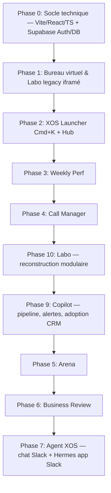

# 🌌 Projet X OS — Portail Intranet de Pilotage Commercial

**Version 3 — actualisée le 2026-07-12** (reconstruction modulaire de Labo, anciennement CRM Cleaner ; versions précédentes conservées dans l'historique git).

Le projet **X OS** (jeu de mots avec XOS et Operating System) est un portail intranet conçu sous la forme d'un **système d'exploitation virtuel (Virtual Desktop)** s'exécutant dans le navigateur.

L'objectif est double :

1. **Pour les Managers** : Offrir un cockpit de pilotage en temps réel de la performance commerciale et de l'hygiène du CRM.
2. **Pour les Commerciaux** : Simplifier leur quotidien en réduisant les frictions de saisie et en priorisant leurs actions avec des outils simples et interactifs.

---

## 🧭 Décisions d'architecture (actées le 2026-07-10)

| Sujet                                   | Décision                                                                                                                                                                                                                                                                                                                                                                                                                             | Motivation                                                                                                                                                                                                                                                                                        |
| --------------------------------------- | ------------------------------------------------------------------------------------------------------------------------------------------------------------------------------------------------------------------------------------------------------------------------------------------------------------------------------------------------------------------------------------------------------------------------------------ | ------------------------------------------------------------------------------------------------------------------------------------------------------------------------------------------------------------------------------------------------------------------------------------------------- |
| **Stack front**                         | **Vite + React + TypeScript**, SPA statique. Pas de Next.js.                                                                                                                                                                                                                                                                                                                                                                         | Composants réutilisables entre apps, état réactif partagé, et garde-fous mécaniques (tsc, ESLint) pour le contrôle qualité du travail des agents d'implémentation. L'API existe déjà en serverless, un framework fullstack n'apporte rien.                                                        |
| **Labo**                                | Labo est désormais un **monolithe modulaire React/TypeScript** natif. La V1 expose le cockpit et le module `Opportunités` avec Nettoyage, Synthèse et Historique ; son contrat est `docs/specs/labo.md`.                                                                                                                                                                                                                             | Le rapport opportunités devient un module d'un outil de santé CRM extensible. La parité legacy a servi de gate de retrait ; le runtime ne conserve plus le code vanilla/Python.                                                                                                                   |
| **Authentification**                    | **Supabase Auth + magic link email**, restreint au domaine `xos-learning.fr` par trigger SQL à l'inscription. Comptes individuels, sessions JWT persistantes par device, révocation immédiate. **En plus** (Phase 8) : bouton **« Se connecter avec Salesforce »** (OAuth) sur l'écran de login — deux options coexistent, le lien magique reste. _(Google SSO abandonné le 2026-07-10 : Théo n'est pas admin Workspace du client.)_ | Un mot de passe partagé est inacceptable pour une app qui écrit dans Salesforce, affiche la perf individuelle et gamifie l'équipe. Le login SF est le chemin naturel pour les commerciaux déjà dans Salesforce et prépare l'attribution niveau 2.                                                 |
| **Persistance**                         | **Supabase Postgres** : profils (mapping ↔ user Salesforce), challenges/scores Arena, configuration, journal d'actions.                                                                                                                                                                                                                                                                                                              | Le journal actuel en Blob immuable est déjà un contournement des limites de Vercel Blob (pas de read-modify-write sûr). Arena et la config exigent requêtes, transactions et concurrence propres.                                                                                                 |
| **Écritures Salesforce**                | Via l'**utilisateur d'intégration** côté serveur, chaque action attribuée à la personne connectée dans le journal Postgres **et dans SF via `OwnerId` = son User Salesforce** (auto-mappé par email — migration 013, en place sur tous les chemins d'écriture depuis le 2026-07-11). Limite connue : `CreatedById` reste l'utilisateur d'intégration.                                                                                | L'attribution **niveau 2** (`CreatedById` correct : écritures sous l'identité de chacun) arrive avec l'OAuth SF par user — lots 8.1/8.1b, sans rien casser (fallback intégration).                                                                                                                |
| **API**                                 | Endpoints serverless Vercel conservés et étendus (nouveaux endpoints en Node, protégés par vérification du JWT Supabase).                                                                                                                                                                                                                                                                                                            | Continuité, pas de réécriture.                                                                                                                                                                                                                                                                    |
| **Périmètre**                           | **Tout le plan, phasé** : socle → Launcher → Weekly Perf → Call Manager → Arena.                                                                                                                                                                                                                                                                                                                                                     | Architecture dimensionnée pour l'ensemble dès le départ.                                                                                                                                                                                                                                          |
| **Cible d'affichage**                   | Desktop-first (métaphore bureau). Mobile : consultation dégradée non prioritaire.                                                                                                                                                                                                                                                                                                                                                    | Le public est l'équipe commerciale au poste de travail.                                                                                                                                                                                                                                           |
| **Surcouche agnostique à l'entreprise** | Le portail est un **outil générique** dont XOS n'est **qu'une configuration**. Toute logique CRM vit derrière un **adapter** (`api/_crm/`, `src/crm/`) ; les noms de champs / picklists / valeurs propres à l'org vivent dans une **config par tenant** (table `crm_mapping`), **jamais en dur** dans le code métier. Pas de multi-CRM ni multi-tenant réel maintenant (YAGNI), mais le seam est posé.                               | Réutilisabilité (rebrancher un autre CRM = nouvelle config + implémentation d'adapter, pas une réécriture). Et **cadrage juridique** : l'outil est un socle propre du Prestataire, développé indépendamment de la mission XOS — les specificités XOS restent des configs, pas le cœur du produit. |
| **Déploiement & URL**                   | Projet Vercel renommé **xos**, domaine canonique actif : **`https://xos.hellotheo.fr`** (redirect URL Supabase à configurer). L'ancien alias **`https://xos-dechet-repo.vercel.app`** reste actif pour assurer la transition. _(⚠️ Ne jamais utiliser xos.vercel.app qui appartient à un autre site)._                                                                                                                               | Zéro migration d'env vars, SPA native, branding propre pour le lancement.                                                                                                                                                                                                                         |
| **Tests des écritures SF**              | Org de production avec précautions : enregistrements de test créés puis nettoyés ; chaque spec d'agent est relue sous cet angle (pas de sandbox disponible).                                                                                                                                                                                                                                                                         | Pratique actuelle d'update.js, discipline vérifiée à la gate QC.                                                                                                                                                                                                                                  |
| **Basic Auth legacy**                   | Coexistence connexion Supabase par lien magique + Basic Auth pendant les phases 0–2, puis **extinction du Basic Auth** une fois l'équipe basculée sur le lien magique Supabase.                                                                                                                                                                                                                                                      | Un secret partagé de moins à terme.                                                                                                                                                                                                                                                               |
| **Intégration Slack + Agent**           | **Chat custom** X OS + **Slack API** (DM user↔bot) pour persistance/miroir mobile. **Cerveau = Hermes, une app Slack** installée dans le workspace (mémoire + skills multi-user, infra opaque côté Théo). X OS/Vercel = UI + **transport Slack uniquement** ; **jamais d'appel direct à Hermes** (tout passe par Slack). Pas d'iframe Slack ; pas d'app Navigateur générique.                                                        | Slack refuse l'embarquement. Hermes centralise l'intelligence via sa propre app Slack ; X OS reste le bureau de travail.                                                                                                                                                                          |

### Réalités des données Salesforce (vérifiées avec Théo)

- Les activités (appels, RDV) **sont loggées** en Tasks/Events → le Pulse hebdo est faisable.
- **L'objet Lead n'est pas utilisé : la prospection vit sur l'objet Contact**, plus Opportunities/Accounts/Campaigns → le Call Manager s'appuie sur les **Contacts à appeler + tâches d'appels Salesforce** (voir app 3). Chaque dashboard commence par un **audit SOQL de volumétrie** pour caler ses définitions avant tout développement UI.

---

## 🎨 Design System & Identité Visuelle (Charte XOS)

Le portail adoptera une esthétique **Dark Mode Premium & Glassmorphism** inspirée des codes visuels de [XOS Learning](https://www.xos-learning.fr/) et de l'interface bureau virtuelle partagée par Thibault Marty (Ottho) :

- **Palette de couleurs (CSS Variables de la charte XOS)** :
  - `--greyscale--grey-100` / Fond principal : Bleu Nuit profond (`#0D173F`) pour l'élégance et le confort visuel.
  - `--primary--primary-200` / Accents & Sélections : Violet néon (`#8B5BFA`) pour les éléments actifs, boutons primaires et focus.
  - `--secondary--secondary-500` / Points d'attention & Alertes : Jaune Lumineux (`#FFF96F`) pour attirer l'œil sur les anomalies.
  - `Bordures & Séparateurs` : Translucide (`rgba(255, 255, 255, 0.08)`) avec un léger flou de fond (`backdrop-filter: blur(12px)`).
- **Typography** : Polices de la charte XOS chargées via `@font-face` :
  - `Brockmann` (police principale pour le texte et les en-têtes).
  - `Aeonik` ou `Neue Montreal` (polices secondaires pour les chiffres et les interfaces de tableau de bord).
  - ✅ **Brockmann livrée** : webfont kit complet dans `fonts/brockmann-complete-webfont/` (woff2 Regular / Medium / SemiBold / Bold + italiques, licence webfont incluse). Les woff2 nécessaires sont copiés dans `public/fonts/` et déclarés en `@font-face` (jamais les .otf desktop, licence différente).
  - ✅ **Neue Montreal livrée** (`fonts/Neue-Montreal-Font-Family/`, OTF Light→Bold + italiques) : **police secondaire retenue pour les chiffres et dashboards** (conversion OTF → woff2 au build, `tabular-nums`).
  - ⛔ **Aeonik : fichiers TRIAL uniquement** (EULA d'essai CoType) — **exclue de la production**, ne jamais l'embarquer dans le build.
  - `Logo officiel` : [logo XOS.webp](https://cdn.prod.website-files.com/6544f8a01bb184e8bf74376c/6548fadbd2f17da27dbdc484_logo%20XOS.webp)
- **Mise en page "Bureau Virtuel"** :
  - **Fond d'écran** : Dégradé fluide et animé entre les couleurs de la charte.
  - **Le Dock X OS** : Barre d'applications flottante en bas de l'écran avec effet de reflet et zoom au survol.
  - **Gestionnaire de Fenêtres** : Ouvrir, fermer (rouge), réduire (jaune), agrandir (vert), déplacer, redimensionner, focus/z-index — implémenté avec `react-rnd`.

---

## 🏗️ Architecture technique

```
/                        SPA React (Vite build → dist/)
├── src/
│   ├── os/              shell : Desktop, Dock, WindowManager, Launcher, thème
│   ├── apps/            une app = un dossier, contrat AppManifest
│   │   ├── cleaner/     cockpit + onglets + modules verticaux ; V1 = Opportunités
│   │   ├── weekly/      Weekly Perf
│   │   ├── calls/       Call Manager (séances de prospection)
│   │   ├── arena/       Gamification
│   │   ├── review/      Business Review (macro, N-1/N-2, partage d'analyses)
│   │   ├── copilot/     Copilot (pipeline, alertes, adoption CRM)
│   │   ├── agent/       Chat Agent XOS (UI custom → Slack API ; Hermes = app Slack)
│   │   └── hub/         Paramètres & statut
│   ├── auth/            login OTP, session, bridge SSO
│   ├── components/ui/   design system partagé
│   ├── lib/             client Supabase, types
│   └── main.tsx
├── public/                 ← assets statiques de la SPA
├── api/                 serverless Vercel — inventaire dans docs/ops/vercel-functions.md
│   ├── cleaner.js       Labo : workspace, analytics, history, preview, execute
│   ├── _cleaner/        règles, autorisation, journal, idempotence, modules métier
│   ├── launcher.js      Cmd+K : SOSL + /log + /create (ex search.js + log.js)
│   ├── auth.js          pont cookie legacy + OAuth SF (?flow=salesforce)
│   ├── calls.js         routeur Call Manager → api/_calls/* (sessions, ciblage, presets, rappels, team)
│   ├── _calls/ _crm/    helpers non exposés (adapter CRM, actions, caches)
│   └── à venir : chat + slack/* (Agent) · arena/* · copilot · review (Business Review)
├── middleware.js        auth edge des fonctions API ; bridge d'auth public
└── supabase/migrations/ schéma Postgres
```

**Contrat d'app** (frontière de délégation aux agents) :

```ts
interface AppManifest {
  id: string; // "cleaner", "weekly"…
  title: string; // nom affiché
  icon: ReactNode; // icône du dock
  component: LazyExoticComponent<FC>; // contenu de la fenêtre
  defaultSize: { w: number; h: number };
  roles?: ('admin' | 'manager' | 'commercial')[]; // visibilité dock (défaut : tous)
}
```

Chaque app est enregistrée dans `src/os/registry.ts`. Une app ne touche jamais au shell ni à une autre app.

**Schéma Supabase** (migrations SQL versionnées) :

- `profiles` : id (= auth.users), email, full_name, `sf_user_id`, role (`admin`/`manager`/`commercial`), `slack_user_id`, `slack_dm_channel_id` _(Phase 7)_
- `settings` : key, value jsonb (seuils de retard, exclusions de comptes…)
- `challenges` : titre, métrique, période, statut, créateur
- `challenge_results` : challenge_id, profile_id, valeur, rang, maj
- `badges` : profile_id, type, date, meta
- `action_journal` : at, actor (profile_id), action_type, changes jsonb, targets jsonb, result jsonb — **remplace le journal Blob** pour les nouvelles actions
- RLS : lecture pour tout utilisateur authentifié ; écritures uniquement via service role (endpoints serverless).

**Auth de bout en bout** :

1. SPA : Supabase Auth (lien magique email, domaine restreint) ; pas de session → écran de login.
2. Endpoints Node : vérification du JWT Supabase (header Authorization) avant toute action ; l'identité vérifiée alimente `action_journal.actor`.
3. `middleware.js` : protège les fonctions API avec le cookie de session X OS ; `/api/auth` et `/api/sso-bridge` portent leur propre vérification JWT et restent publics pour le bridge.

**Cache des données** : les réponses personnalisées de Labo ne vont jamais dans un cache CDN partagé. Le backend peut conserver brièvement les données Salesforce brutes, puis applique le scope utilisateur avant de répondre. `perf`, `calls` et les futurs endpoints analytics gardent leurs politiques propres ; `search` reste sans cache.

---

## 🚀 Les Applications du Dock (Le Hub X OS)

### 1. 🧪 Labo (Santé & correction du CRM) — _Reconstruction modulaire prioritaire_

Labo devient un **atelier modulaire**. Le rapport legacy sur les opportunités est recodé et redesigné comme premier module ; les futurs modules Doublons, Contacts et Comptes pourront s'ajouter sans réécrire le shell.

- **Navigation** : cockpit hybride (santé factuelle + orientation vers l'action), onglet `Accueil` fixe, un onglet unique par module, état de travail conservé.
- **V1 — Opportunités** : trois vues internes `Nettoyage` / `Synthèse` / `Historique`. Le bandeau KPI compact B1 précède une file de nettoyage dominante ; les analyses legacy (owner, étape, retard, raisons) vivent dans Synthèse.
- **Parité legacy obligatoire** : KPIs, score expliqué, filtres croisés ET/OU, tri, pagination, recherche, sélection de tout le résultat filtré, réassignation, CloseDate, étape, type de vente, fermeture en perdue avec picklists dépendantes, résultats partiels, historique et deep link `/clean?q=`.
- **Écritures** : sélection → preview serveur → confirmation → exécution idempotente → journal Supabase. Les échecs restent sélectionnés et visibles.
- **Rôles** : commercial = ses opportunités ; manager/admin = équipe et actions globales, imposé côté serveur.
- **Frontière Copilot** : Labo corrige les anomalies objectives ; Copilot recommande les actions commerciales. L'inactivité seule n'est jamais un critère d'entrée Labo.
- **Architecture** : monolithe modulaire en tranches verticales, `api/cleaner.js` mince + `api/_cleaner/`, champs SF dans `api/_crm/mapping.js`.
- **Migration** : import idempotent complet du journal Blob vers `action_journal`, puis retrait du legacy après gate de parité. Suppression des blobs uniquement sur accord explicite.
- **Contrats** : `docs/specs/labo.md` · `docs/plans/labo-implementation.md`.

### 2. 📈 Weekly Perf (Cockpit Hebdomadaire) — _Nouveau_

Suivi hebdomadaire de la performance commerciale pour piloter le rythme de vente. _(Décision 2026-07-11 : Weekly reste **micro/hebdo** — le macro multi-périodes vit dans **Business Review**, deux apps distinctes.)_

- **Le "Pulse"** : par commercial et par semaine — appels (Tasks type appel), RDV (Events), propositions envoyées (opportunités entrées en étape "Proposition envoyée" sur la période, via `OpportunityHistory`).
- **Pipeline Généré vs Gagné** : somme des montants des opps créées vs gagnées par semaine (graphique comparatif) + taux de closing.
- **Le Taux d'Effort** : nombre de progressions d'étape (primaire) + ratio sur opps ouvertes (secondaire), via `OpportunityHistory`.
- **Vues** : « Moi » (tous) / « Équipe » (manager+admin) ; filtre « Commerciaux seulement » par défaut.
- **Contrat** : `docs/specs/weekly-perf.md` (définitions figées + API + plan UI).
- **Précondition** : audit SOQL livré (`docs/audits/lot-3.0-metriques-activite.md`) — validations actées 2026-07-11.

### 3. 🎯 Call Manager (Séances de Prospection) — _Nouveau — Phase 4_

Outil **opérationnel** pour enchaîner les appels de prospection sans friction (pas un dashboard d'analyse) :

- **Séance de prospection** : le commercial crée une séance et se voit attribuer une **liste séquentielle de contacts à appeler** ; le moteur (`api/calls.js`) gère la progression et les statistiques de session.
- **Appel rapide** : bouton d'appel + **formulaire de log d'appel pré-rempli** (compte/contact/opp) pour enchaîner les appels en 1 clic et logguer directement dans Salesforce.
- **Suivi de session** : avancement dans la liste, contacts traités/restants, statistiques d'effort de la séance.
- **v2 — Moteur de ciblage** _(contrat : `docs/specs/call-manager-v2.md`)_ : filtres **granulaires et modulaires** (entreprise : secteur, effectif, type de client, opp ouverte/perdue, groupe→filiales ; contact : téléphone, niveau de décision, exclusion NPA ; **relance** : jamais appelé, dernier appel avant/dans N jours, dernier résultat, fréquence max sur 30/60 j, durée) avec **OU** intra-famille et **presets** sauvegardables. **Dédup** avertir/exclure vs séances des collègues. Log enrichi (`Resultat_call__c` + durée), **RDV planifié → Event**, séances de **relance**. **Attribution niveau 1** : Task/Event posées avec `OwnerId` = le commercial connecté.
- **Précondition** : audit SOQL des tâches d'appels (statut, historique d'efforts, volumétrie comptes/contacts par commercial) — validé par Théo avant l'UI.

### 4. ⚡ XOS Launcher (Spotlight Command) — _Nouveau_

Un centre de commande rapide inspiré de Spotlight (macOS), accessible via `Cmd + K` (lib `cmdk`).

- **Recherche** : comptes, contacts, opportunités via SOSL (`api/search`), navigation vers la fiche SF ou les apps X OS.
- **Actions instantanées** :
  - `/log` : saisie d'une note d'appel rapide → crée une Task Salesforce rattachée au compte/contact/opp, attribuée dans le journal à l'utilisateur connecté (mention "via X OS par {nom}" dans la description SF).
  - `/create` : création express d'un **Contact** (pas d'objet Lead dans cet org).
  - `/clean` : ouvre Labo pré-filtré sur un compte donné.
- _Bénéfice_ : gain de temps massif par rapport aux temps de chargement de Salesforce.

### 5. 🏆 XOS Arena (Gamification & Challenges) — _Nouveau_

**Direction révisée 2026-07-17** (retour test utilisateur Combo, voir `docs/specs/combo-gamification-v1.md`) :

Arena garde sa vocation (challenges d'équipe + reconnaissance collective) mais **change d'angle** : on passe d'un système compétitif (leaderboard, médailles, classement) à un système **collaboratif et anonyme**.

- **Pas de leaderboard public.** Pas de rang affiché nominativement. Pas de médaille "1er/2e/3e".
- **Défis hebdomadaires** créés par les managers depuis l'app, sur catalogue de métriques (qualité CRM, RDV, rappels, complétude). Templates V1 :
  - Cumulatif : "100 RDV équipe cette semaine"
  - Solidarité : "5 commerciaux font ≥ 10 appels lundi"
  - Relais : "Tous les commerciaux appellent leurs rappels dus"
- **Reconnaissance anonyme par défaut.** Le feed d'équipe ("Quelqu'un vient de passer Or vitesse") n'affiche un nom que si l'utilisateur a explicitement opté pour (case dans `profiles`).
- **Mur des réussites personnel** (badges one-timer, paliers XP) reste **dans Combo** (menu Aide → "Mes réussites") — pas dupliqué dans Arena. Cf. spec `combo-gamification-v1.md` §5.
- **Médaille collective** (badge 🤝 Relais) décernée à tous les contributeurs d'un défi atteint — anonyme par défaut, opt-in pour signature.

**Coordination avec Combo V1** :
- Combo émet déjà les `kind` de notifs `defi_collectif_atteint` et `relais` (réservés mais pas émis — cf. `combo-gamification-v1.md` §3.1). Arena les consommera sans changement d'API.
- Tables déjà migrées : `challenges`, `challenge_results`, `badges` (migration `001_initial_schema.sql`).

_Bénéfice_ : augmente l'adoption du CRM et la qualité des données par la **pression sociale positive** (étude citée par Théo : affichage public des temps de réponse des agents → +40% de taux de réponse, sans classement strict) plutôt que par compétition pure.

---

- **Statut** : connexion API Salesforce, quotas d'appels restants (endpoint SF `/limits`), fraîcheur des caches.
- **Configuration** (managers + admin) : seuils de retard, exclusions de comptes — stockés dans `settings` (Supabase), consommés par les endpoints.
- **Compte** : profil connecté, mapping vers le user Salesforce, déconnexion.
- **Accès** (admin seulement) : gestion des rôles `commercial` / `manager` / `admin`.
- Contrat détaillé : `docs/specs/roles-and-hub.md`.

### 7. 🤖 Agent XOS (Chat + Slack + Hermes) — _Nouveau — Phase 7_

Assistant conversationnel : **go-to quotidien** de l'équipe. X OS est l'interface ; **Hermes (une app Slack)** est le cerveau ; Slack est le fil de messages partagé (dont mobile).

- **Ce que ce n'est pas** : iframe Slack, app Navigateur générique, ni LLM embarqué dans le repo Vercel.
- **Parcours utilisateur** :
  1. Connexion X OS (magic link `@xos-learning.fr`).
  2. Première visite : **Connecter Slack** (OAuth) → `profiles.slack_user_id`.
  3. App **Agent** : DM privé user ↔ bot Hermes ; Hermes reçoit le message côté Slack et l'identifie par son `slack_user_id` pour charger **sa** mémoire et **ses** skills.
- **Architecture** :
  - **Front** (`src/apps/agent/`) : UI messagerie.
  - **Vercel** (`api/chat`, `api/slack/`) : auth JWT + **transport Slack uniquement** (poster/lire les DM, webhook events) ; jamais d'appel direct à Hermes.
  - **Hermes (app Slack)** : agent multi-user — **mémoire par commercial** + **skills** (Salesforce, log d'appel, Labo, recherche, etc.) configurés côté Hermes ; reçoit les DM via sa propre intégration Slack.
  - **Slack** : persistance et sync du fil ; reprise dans l'app Slack native.
- **Bénéfice** : un seul assistant qui connaît le contexte de chaque commercial et agit sur les vrais outils, sans quitter X OS.

### 8. 🧭 Copilot (Pilotage du pipeline & assistant d'action) — _Nouveau — Phase 9 (priorité produit : avant Arena)_

Le cockpit **prescriptif** du commercial : là où Weekly Perf regarde en arrière (ce qui s'est passé) et Call Manager exécute (les appels du jour), Copilot répond à la question quotidienne _« comment piloter mon activité commerciale aujourd'hui ? »_. **Vue strictement personnelle** — pas de vue équipe ni de sélecteur de commercial (sinon illisible ; le pilotage d'équipe reste dans Weekly Perf). Moteur de **règles déterministes** (pas de LLM dans le repo — le volet conversationnel reste Hermes, Phase 7). Périmètre validé le 2026-07-11 :

- **Pipeline de travail** : les opportunités ouvertes du commercial triées par urgence (CloseDate proche/dépassée, montant, étape), « à clôturer sous 30 jours » en avant, signal d'hygiène (CloseDate passée → pont Labo).
- **Alertes & prochaines actions** : détection d'opps dormantes (aucune activité depuis N jours), bloquées (pas de progression d'étape — réutilise la logique `OpportunityHistory` de 3.1), propositions sans suite, RDV passés sans next step. Chaque alerte porte une **action en 1 clic** (Task de relance avec `OwnerId` = le commercial, Event, `/log`, séance Call Manager pré-ciblée) — via les endpoints existants, Copilot n'introduit pas de nouveau chemin d'écriture SF.
- **Stratégies de prospection** : analyse du portefeuille (segments à meilleur taux de gain, comptes à opp perdue ré-attaquables) → suggestions concrètes sous forme de **presets de séance Call Manager pré-remplis**.
- **Adoption & qualité CRM** : mon usage du CRM — appels loggés, Events, contacts et comptes créés sur fenêtre glissante (mêmes définitions que Weekly Perf, pas de deuxième vérité), comparés à ma propre période précédente — et **complétude des champs critiques** de mes enregistrements (opps, contacts, comptes ; liste des champs dans le mapping CRM, jamais en dur). La lecture équipe de ces indicateurs reste hors Copilot (Weekly Perf, et challenges Arena qui les consommeront — lot 5.1).
- **Contrat** : `docs/specs/copilot.md`. **Précondition** : audit SOQL (lot 9.0) — calibrage des seuils et validation Théo avant toute UI.

### 9. 📊 Business Review (Cockpit Macro) — _Nouveau — Phase 6 (re-spécifiée 2026-07-11)_

Le cockpit **macro** du pilotage, complément deux-apps de Weekly Perf (décision 2026-07-11) : portage X OS du dashboard V6 construit côté Hermes.

- **Périodes & comparaisons** : granularité Semaine / Mois / Trimestre / Année, navigation historique libre, comparaison automatique même période **N-1** (et N-2) ; tous les KPIs suivent la période sélectionnée.
- **Analyses** : CA signé et pipeline par commercial (filtres pilotés par les profils), répartition CA par type de vente, funnel SDR (`Resultat_call__c`), opportunités à l'attention (sans action / clés / chaudes, score de pertinence).
- **Partage d'analyses** : un manager/admin partage une vue configurée (période + filtres + note) avec un commercial — table `shared_analyses`, données recalculées à l'ouverture ; le commercial ne voit que « Partagées avec moi », pas d'explorateur macro libre.
- **Contrat** : `docs/specs/business-review.md`. **Précondition** : audit 6.0 (FY, CA signé, profondeur N-2, picklists) — validation Théo avant l'UI.

---

## 📅 Stratégie d'Implémentation



_Les numéros de phase sont des identifiants stables. La Phase 10 Labo est le chantier prioritaire courant ; elle précède la Phase 9 Copilot, qui reste prioritaire sur Arena._

Le détail des lots, l'assignation aux agents (via Orca) et les critères de vérification par lot sont dans **`docs/xos_implementation_plan.md`**.

**État Labo après cutover** : `CleanerApp` ouvre le shell natif et `/clean?q=` conserve le filtre de recherche. Les lectures et écritures passent par `/api/cleaner` (workspace, analytics, history, preview, execute) ; l’historique cible `action_journal` Supabase. La migration réelle Blob→Supabase, les écritures Salesforce live et toute suppression Blob restent bloquées sans approbation explicite et credentials dédiés. Aucun volume réel n’est inventé dans cette documentation.

### Risques identifiés

1. **Config Vercel SPA** (Vite + fonctions Node + middleware) : traitée en tout premier (lot 0.1), puis simplifiée lors du cutover Labo.
2. **Définitions des métriques** (Pulse, entonnoir) dépendantes de la discipline de saisie réelle : audits SOQL préalables + validation Théo avant chaque UI de dashboard.
3. **Polices** : Brockmann (webfont) + Neue Montreal (OTF→woff2) livrées ; ⚠️ Aeonik en version TRIAL seulement → exclue de la prod.
4. **Quotas API Salesforce** : `perf`/`calls` gardent leurs caches adaptés ; Labo cache brièvement les données org brutes et ne partage jamais une réponse personnalisée. Le Hub affiche la consommation.
5. **Slack + Hermes** : workspace unique ; rate limits Slack ; **Hermes = app Slack** (skills et mémoire gérés côté Hermes, pas dans le repo X OS) ; X OS ne parle qu'à Slack.
6. **Bascule Labo** : régression fonctionnelle masquée par le redesign. Traitement : matrice de parité exécutable, preview/execute idempotent, migration à blanc puis contrôlée, legacy conservé jusqu'au gate final.

---

## 🧬 Trajectoire produit & IP (actée le 2026-07-11)

Le portail est développé comme un **socle générique réutilisable** (propriété du Prestataire, conçu indépendamment de la mission XOS) dont **XOS n'est que la première configuration**. Cette section fige la frontière et la trajectoire — rien ici n'est à implémenter maintenant.

### Frontière socle / config (état réel au 2026-07-11)

| Spécifique XOS (config, remplaçable)                                                                          | Où ça vit aujourd'hui                                                                                                                                              |
| ------------------------------------------------------------------------------------------------------------- | ------------------------------------------------------------------------------------------------------------------------------------------------------------------ |
| Noms de champs, picklists, valeurs org Salesforce (secteurs, effectifs, résultats d'appel, presets fonction…) | `api/_crm/mapping.js` (serveur) + miroir `src/crm/` (front) — **aucun nom de champ SF en dur ailleurs**, contrôlé en revue à chaque lot                            |
| Implémentation CRM (SOQL, OAuth, écritures Task/Event)                                                        | Adapter `api/_crm/salesforce.js` — Salesforce = une implémentation derrière l'interface                                                                            |
| Charte graphique (couleurs, fenêtres, typo)                                                                   | `src/os/theme.css` (tokens `--xos-*`, ~120 usages dans le code)                                                                                                    |
| Assets de marque (polices Brockmann / Neue Montreal, logo, wallpaper)                                         | `public/fonts/`, `src/assets/` — **polices sous licence XOS, ne suivent pas le socle**                                                                             |
| Credentials (SF OAuth, Supabase)                                                                              | Variables d'env Vercel (globales, pas par tenant)                                                                                                                  |
| Résidus connus à extraire le jour venu                                                                        | URL d'instance SF en fallback dans `salesforce.js` ; ~16 valeurs de charte en dur dans `boot.css`/`desktop.css` _(login.css aligné tokens `--xos-*` — 2026-07-10)_ |

Tout le reste — bureau virtuel, window manager, moteur de ciblage, runner de séances, presets, dédup, journal — est **cœur de produit, agnostique**.

### Vision cible : produit indépendant

1. **Multi-tenant** : le module `mapping.js` devient une table `crm_mapping` (config par tenant), l'adapter est choisi par config (`salesforce`, `hubspot`, …). Le seam actuel est déjà exactement celui-là.
2. **Onboarding client** : connexion du CRM (OAuth par tenant), assistant de mapping (objets/champs/picklists), choix des presets métier, branding.
3. **Theming par tenant** : `theme.css` devient un jeu de tokens par tenant (couleurs, logo, wallpaper, polices du client). Prérequis : résorber les résidus listés ci-dessus (petit lot de consolidation, non urgent).
4. **Credentials par tenant** : sortir les creds des env globales vers un stockage chiffré par tenant.

### Cadrage IP

- **Antériorité** : la conception agnostique est documentée et datée (`docs/specs/call-manager-v2.md` § Principe directeur, 2026-07-10 ; présente section, 2026-07-11) et traçable dans l'historique git (adapter + mapping livrés au lot v2.A).
- **Ce qui appartient au socle** : tout le code hors tableau ci-dessus, y compris la structure de l'adapter et le format de mapping (le _format_ est du socle ; les _valeurs_ XOS sont de la config mission).
- **Ce qui reste à la mission XOS** : les valeurs de mapping, la charte, les assets de marque, les licences de polices, les données Supabase et les creds.
- **Checklist de sortie** (créer le produit indépendant) : forker le socle sans `mapping.js` rempli, sans `public/fonts/` ni assets XOS, sans env ; re-brander via tokens ; vérifier qu'aucune donnée/valeur XOS ne subsiste (grep picklists + secrets scan).
- ⚠️ **À valider côté contrat de mission** : clause de propriété du socle vs livrables spécifiques. Point juridique humain, hors périmètre du repo.

**Hors périmètre maintenant** (YAGNI, inchangé) : multi-CRM réel, multi-tenant, onboarding, theming dynamique. Le code doit seulement _rester prêt_ : nouveau spécifique XOS ⇒ dans le mapping ou les tokens, jamais dans le cœur.
